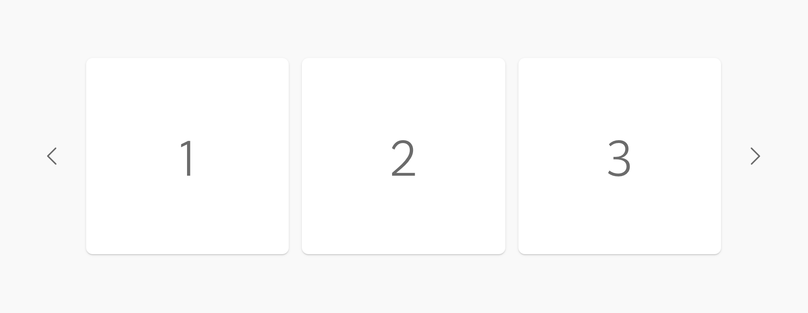
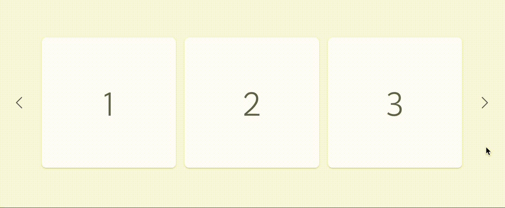
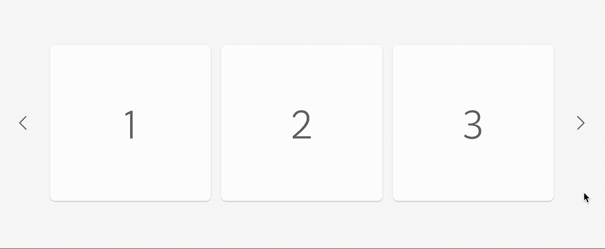

# s4-react-test

A take-home coding project to demonstrate knowledge of React.

## Project Context

The objective of this coding exercise is to build a reusable carousel component with React. Given a mockup and a few acceptance criteria, you should be able to demonstrate and be willing to talk about your decision-making involving directory structure, code composition, naming and syntax, and overall attention to detail and accuracy compared to the designs.

> **Example story:** As a user, I want a carousel UI component so that I can easily scroll through different slides of content.

## Constraints

- Feel free to use open source UI libraries if you'd like, but avoid using existing carousel components. This exercise is intended to show your own custom implementation of a carousel.
- Think dynamic - this component should be structured in a way that encourages reuse. How could you write your code to abstract the functionality into reusable patterns?
- Don't worry too much about pixel-perfect implementation since you'll only be working from a screenshot rather than real tech specs. Do your best to make the component as accurate as you can though.

## Design Assets

#### Screenshot

#### Click functionality

#### Infinite scroll

## Acceptance Criteria

1. Render a Carousel component for desktop with 4 slides
1. Able to click arrow buttons to move forward and backward through the slide show
1. Moving forward or backwards through the carousel should create an "infinite scroll" effect (e.g. clicking next starts over slide 1 - clicking back on slide 1 moves back to slide 4, etc.)

## Bonus Points

Most importantly, focus on the above acceptance criteria, and prepare to discuss the following in a followup session — if you have time to demonstrate in code as part of the test, go for it!

- **Testing:** How would you test this component? Feel free to include any unit or snapshot tests to demonstrate your knowledge in this area.
- **Accessibility:** Are you passionate about making your components accessible for all users? We are too! What would you include to ensure this component is WCAG and ADA compliant?
- **Responsiveness:** Since you were only given the mockup for a desktop solution, how might you adjust this component or what strategies would you use to make it responsive for mobile and tablet screen sizes?
- **Use in a Library:** Do you have experience maintaining libraries and packages? How might you package this project up using a bundler like Webpack or Rollup to make this code available as a standalone library?
- **Additional Component Features:** Feel free to get creative here. What are some other features you've seen in other carousel implementations? Are there other ways you can think of to make the existing features even more dynamic?

## Additional Notes & Project Delivery

In this directory we've provided the base infrastructure for a React project using `create-react-app`. You can run it with the `start` script and you'll see a placeholder div for where to put your carousel in `src/App.js`. After completion, please be sure to delete the `node_modules` directory before compressing and sending back to us.

If you are having trouble creating a complete solution, sending over a partial solution is OK! We would love to see any amount of this component completed to demonstrate your abilities.
